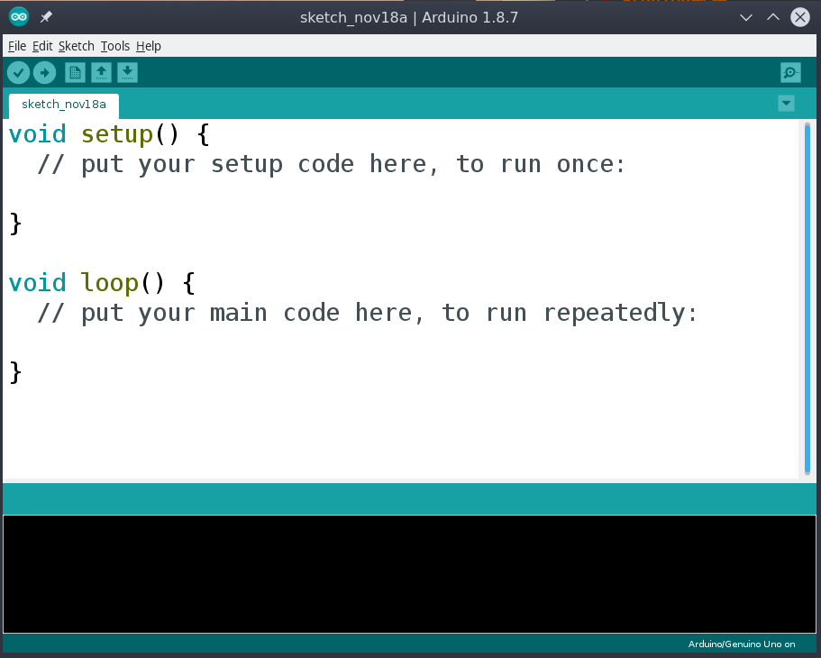
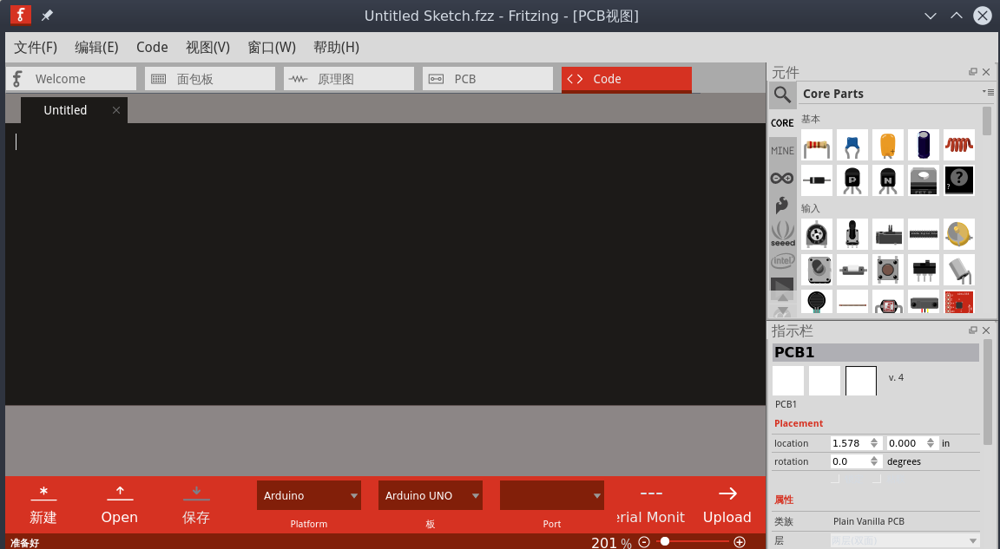
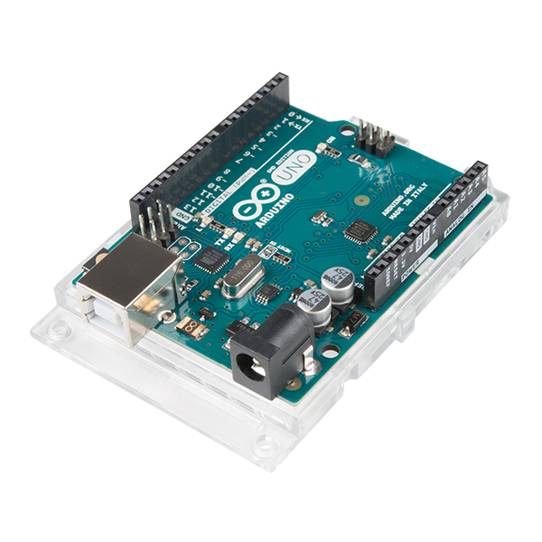
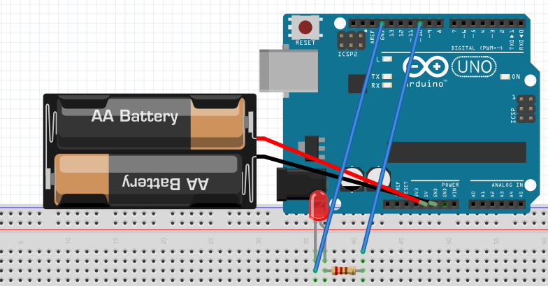

# arduion教程

## 环境准备
### 编程软件
#### Arduino IDE

##### 下载链接
官方<https://www.arduino.cc/en/Main/Software>  
中文社区<https://www.arduino.cn/resource-view-1.html>  
百度网盘<https://pan.baidu.com/s/1b3Otx8-ysmUxs9fwpKovPA>  
##### 安装教程  
CSDN<https://blog.csdn.net/qq_23937195/article/details/68944217>
#### Fritzing

##### 下载链接
官方<http://fritzing.org/download/>  
中文社区<https://www.arduino.cn/resource-view-11.html>  
### 基础硬件
#### arduino板

#### 串口线

## 语法解析
**数据类型**

 类型 | 含义
 --- | ---
 void | 空
 boolean | 布尔
 char | 字符
 unsigned char | 无符号字符
 byte | 字节
 int | 整型
 unsigned int | 无符号整型
 word | 词
 long | 长整型
 unsigned long | 无符号长整型
 short | 短整型
 float | 单精度浮点型
 double | 双精度浮点型
 array | 数组
 String-char array | 字符串
 String-object | 字符串对象

---
```arduino
void setup(){

}
```
开始时调用setup（）函数。使用它来初始化变量，引脚模式，开始使用库等。设置功能仅在每次上电或复位Arduino板后运行一次.  
```arduino
void loop(){

}
```
在创建初始化和设置初始值的setup（）函数之后，loop（）函数为连续的循环，并且连续循环，允许程序进行更改和响应。用它来主动控制Arduino.  
```arduino
void setup(){
    pinMode (pin , mode);
}
```
设置引脚模式  
pin - 要设置其模式的引脚编号  
mode - INPUT(输入），OUTPUT(输出)或INPUT_PULLUP(上拉输出)  
```arduino
void loop(){
    digitalWrite(pin, value);
}
```
控制引脚模式  
pin - 要设置其模式的引脚编号  
value - HIGH或LOW。  
```arduino
void loop(){
    analogRead(pin);
}
```
模拟读取  
pin - 要读取的模拟输入引脚的编号（带有～的引脚即可）  
```arduino
void loop(){
    analogWrite(pin, value);
}
```
控制引脚模式(模拟)  
pin - 要设置其模式的引脚编号  
value - 一般为0-1023的整数  

## 简单实践- 呼吸灯
### 需要器件
`arduino uno板` `led灯` `1k电阻`
### 电路图

### 代码
```arduino
int ledPin = 10;

void setup() {
    pinMode(ledPin,OUTPUT);
}

void loop(){
    fadeOn(1000,5); 
    fadeOff(1000,5);
}

void fadeOn(unsigned int time,int increament){

    for (byte value = 0 ; value < 255; value+=increament){ 
        analogWrite(ledPin, value); 
        delay(time/(255/increament)); 
        }

}

void fadeOff(unsigned int time,int decreament){
    for (byte value = 255; value >0; value-=decreament){
        analogWrite(ledPin, value);
        delay(time/(255/decreament));
        }

}
```
## 扩展资料
官网<https://www.arduino.cc/>  
中文社区<https://www.arduino.cn/>  
推荐教程<https://www.tutorialspoint.com/arduino/>  
[blocklyduino](http://blocklyduino.github.io/BlocklyDuino/blockly/apps/blocklyduino/)在线可视化编辑器 *github地址*<https://github.com/BlocklyDuino/BlocklyDuino>
