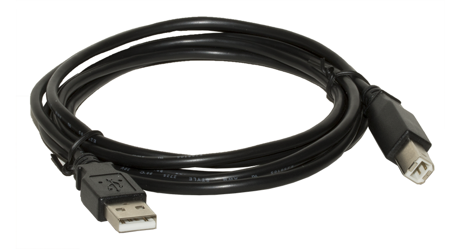

# arduion教程

## 环境准备
1. 编程软件
    1. Arduino IDE
    
    2. Fritzing
    
2. 基础硬件
    1. arduino板
    
    2. 串口线
    
## 简单实践
1. 呼吸灯
    1. 需要器件
    `arduino uno板` `led灯` `1k电阻`
    2. 电路图
    
    2. 代码
```arduino
int ledPin = 10;

void setup() {
    pinMode(ledPin,OUTPUT);
}

void loop(){
    fadeOn(1000,5); 
    fadeOff(1000,5);
}

void fadeOn(unsigned int time,int increament){

    for (byte value = 0 ; value < 255; value+=increament){ 
        analogWrite(ledPin, value); 
        delay(time/(255/increament)); 
        }

}

void fadeOff(unsigned int time,int decreament){
    for (byte value = 255; value >0; value-=decreament){
        analogWrite(ledPin, value);
        delay(time/(255/decreament));
        }

}
```
## 扩展资料
官网: <https://www.arduino.cc/>
推荐教程：<https://www.tutorialspoint.com/arduino/>
[blocklyduino](http://blocklyduino.github.io/BlocklyDuino/blockly/apps/blocklyduino/)在线可视化编辑器 *github地址*<https://github.com/BlocklyDuino/BlocklyDuino>
