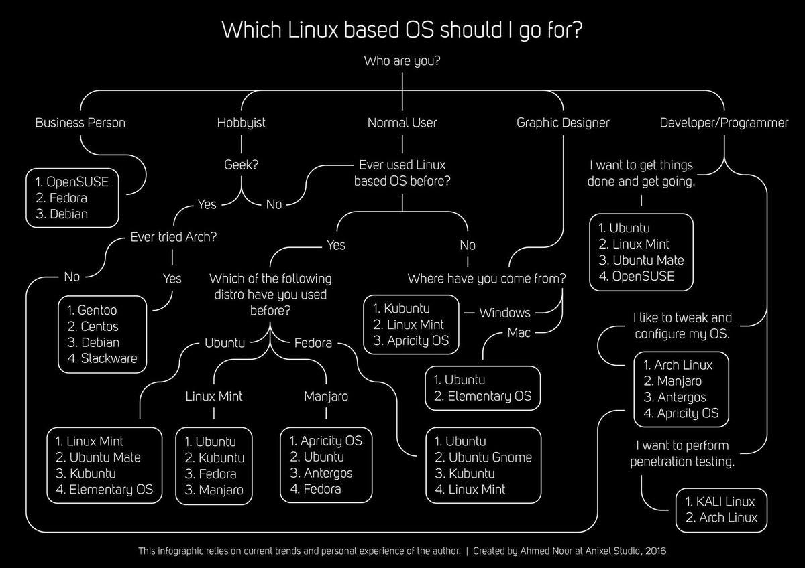
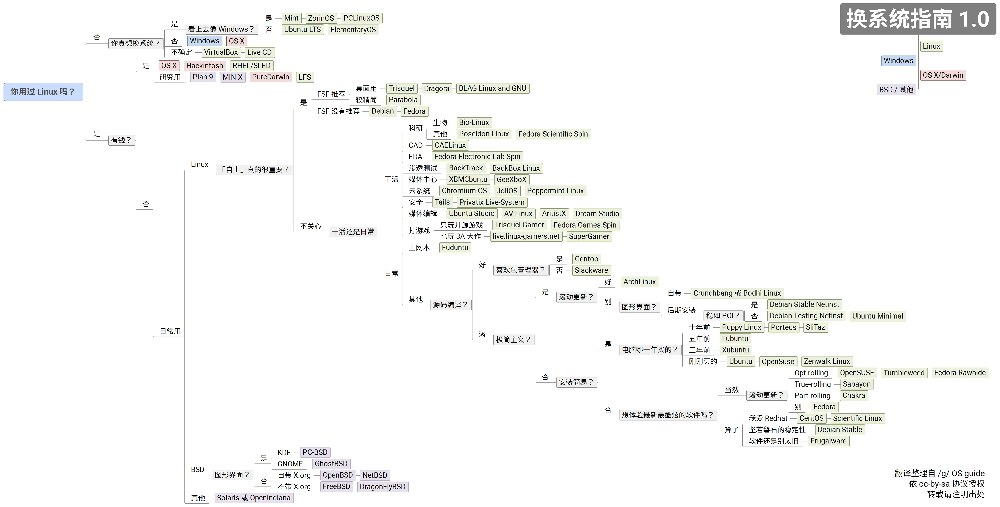
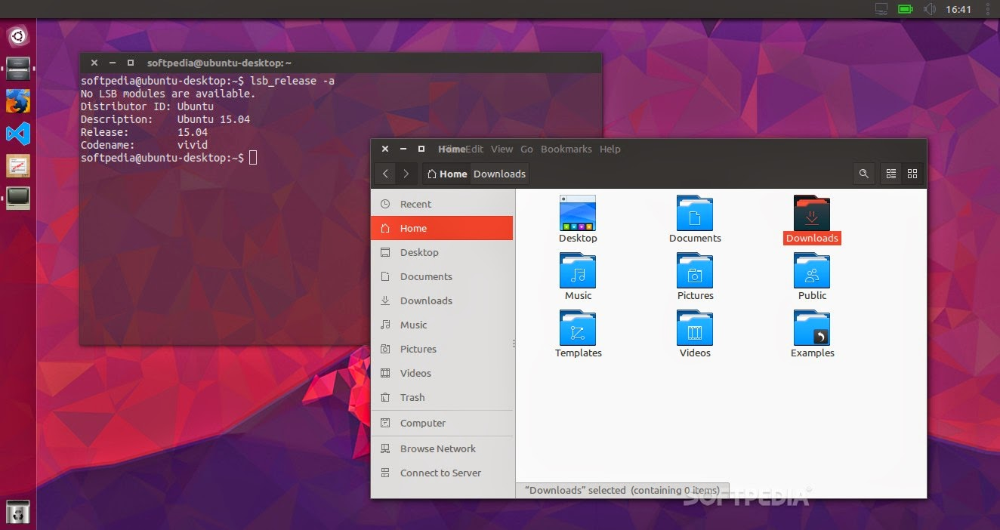
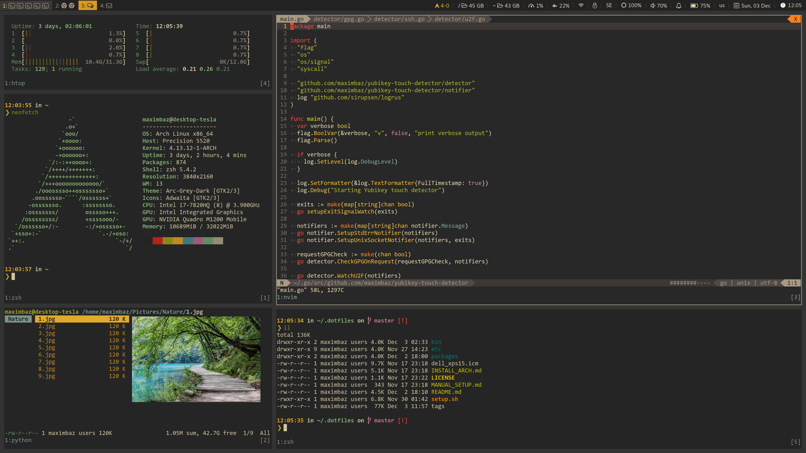
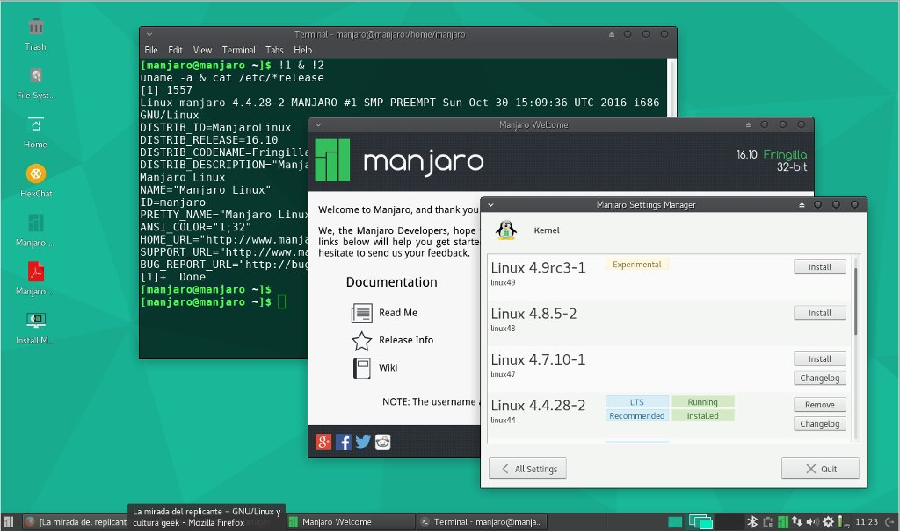
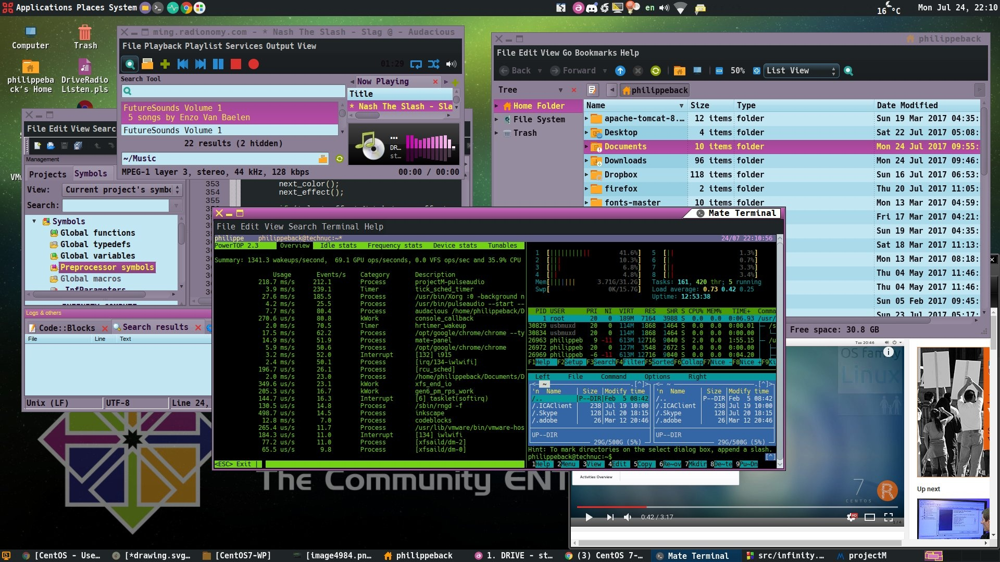
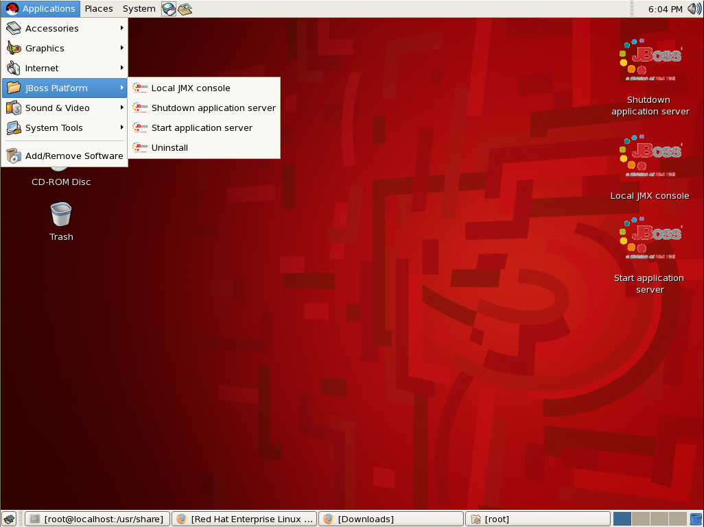
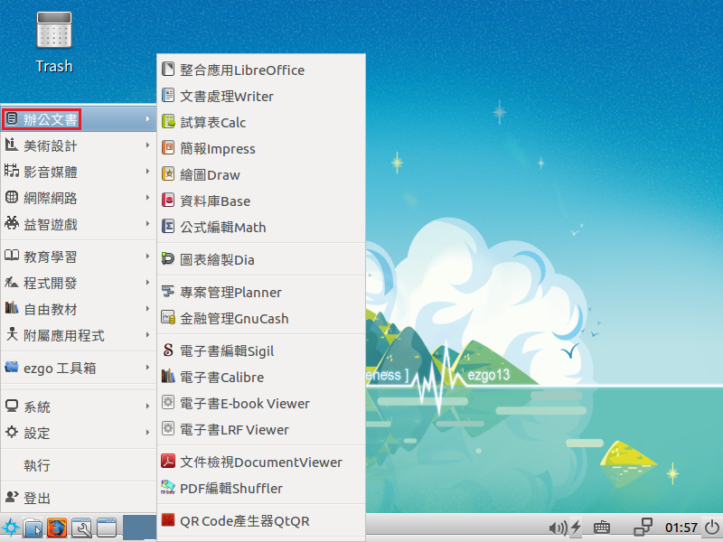
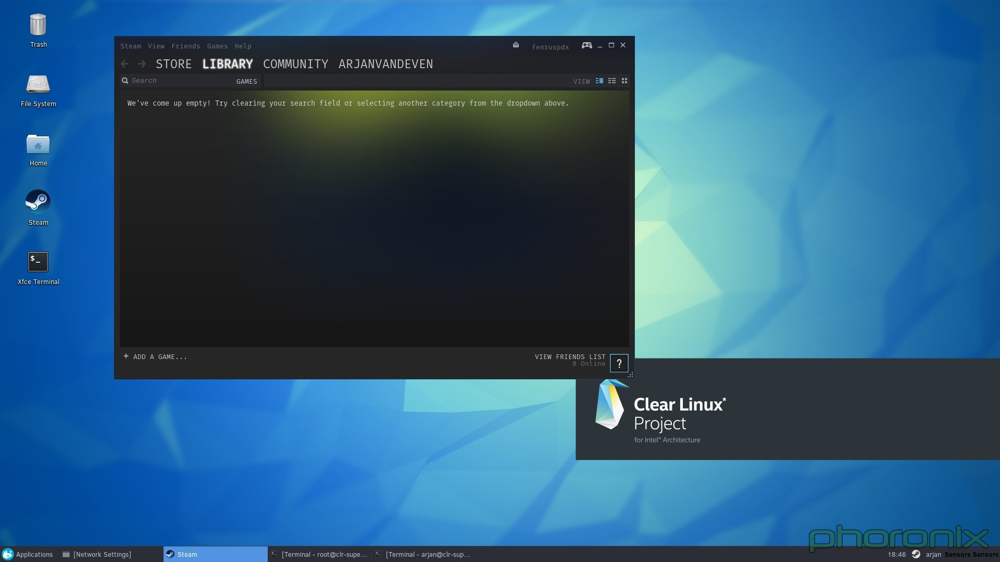
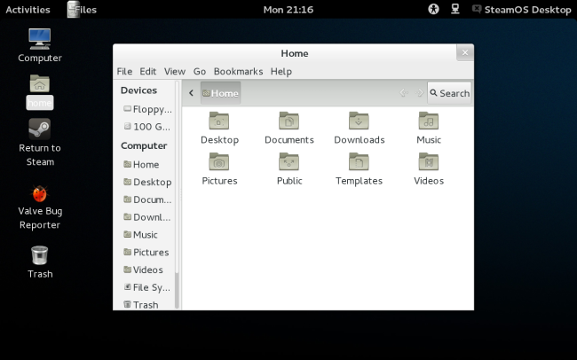

# Linux历史及发行版的选择和安装
[培训PPT](../ppt/开源第一讲.pptx)

---
## 如何选择linux

## 教程链接
  
 2018年最好的linux发行版介绍:<https://www.techradar.com/news/best-linux-distro> 
 2018 最佳Linux 发行版排行榜: <https://zhuanlan.zhihu.com/p/33771775>  
 linux维基百科: <https://zh.m.wikipedia.org/wiki/Linux>

## 发行版官网
  
 ubuntu: <https://wiki.ubuntu.com>  
 `简单` `易用` `用户多` `基于debian`  
  
---
  
 archlinux: <https://wiki.archlinux.org>  
 `定制` `文档好` `包管理强` `滚动发行`  
  
---
  
 manjaro: <https://www.manjaro.org>  
 `美观` `基于arch` `新手友好` `滚动更新`  
  
---
  
 debian: <https://wiki.debian.org/zh_CN/FrontPage?action=show&redirect=Ê×Ò³>  
 `GNU` `稳定` `简单`  
  
---
  
 deepin: <https://wiki.deepin.org>  
 `国产` `美观` `windows移植程序多`  
  
---
  
 centos: <https://wiki.centos.org>  
 `RedHat` `稳定` `服务器`  
  
---
  
 RedHatEnterprise: <https://www.redhat.com/zh/technologies/linux-platforms/enterprise-linux>  
 `RedHat` `稳定` `服务器`  
  
---
  
 ezgo: <https://ezgo.westart.tw>  
 `台湾` `教育` `基于ubuntu` `亲子`  
  
---
  
 ClearLinux: <https://clearlinux.org>  
 `Intel` `容器` `性能最快`  
  
---
  
 SteamOS: <https://store.steampowered.com/steamos>  
 `Steam` `游戏` `valve`  
  
---
 WLinux: <https://www.microsoft.com/zh-cn/p/wlinux/9nv1gv1pxz6p?activetab=pivot:overviewtab>  
 `nonfree` `收费`  
 :blush: WSL: <https://docs.microsoft.com/en-us/windows/wsl/install-win10>  
 `microsoft` `nonfree` `命令行` `win10`  

## 国内镜像源
 [中科大](http://mirrors.ustc.edu.cn)  
 [阿里云](http://mirrors.aliyun.com)  
 [清华大学](http://mirrors.tuna.tsinghua.edu.cn)  
 [浙江大学](http://mirrors.zju.edu.cn)  
 [东软大学](http://mirrors.neusoft.edu.cn)  
 [搜狐](http://mirrors.sohu.com)  
 [网易](http://mirrors.163.com)  
 [华中科技大学](http://mirror.hust.edu.cn)
