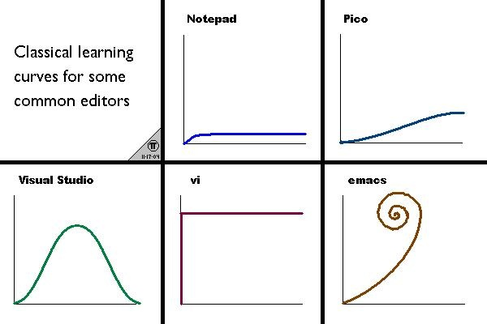

# linux相关应用软件的选择和安装
---
## 软件安装
1. 包管理
    * ubuntu(debian系)
    [apt](https://blog.csdn.net/mynameislinduan/article/details/21197417)
    [dpkg](http://man.linuxde.net/dpkg)
    * arch系
    [pacman](https://wiki.archlinux.org/index.php/Pacman)
    [aur](https://wiki.archlinux.org/index.php/AUR_helpers)
    * centos
    [rpm](http://man.linuxde.net/rpm)
    [yum](http://www.vixual.net/blog/archives/101)
2. 源码编译
    [一般步骤](http://blog.51cto.com/criss/464581)
    * 相关命令介绍
    tar:<https://www.jianshu.com/p/b91d7491381b>  
    make:<http://www.ruanyifeng.com/blog/2015/02/make.html>  
3. 软件帮助
    * man
    * --help

## 开发环境搭建
1. 编辑器选择

    1. vim & emace
    
    
    2. atom
    3. sublime
2. 编译器安装和使用
    1. C/C++
    2. java
    3. python

## 终端使用
archlinux相关文档:<https://wiki.archlinux.org/index.php/Core_utilities_(%E7%AE%80%E4%BD%93%E4%B8%AD%E6%96%87)>

[软件推荐](https://linux.cn/article-7712-1.html)

